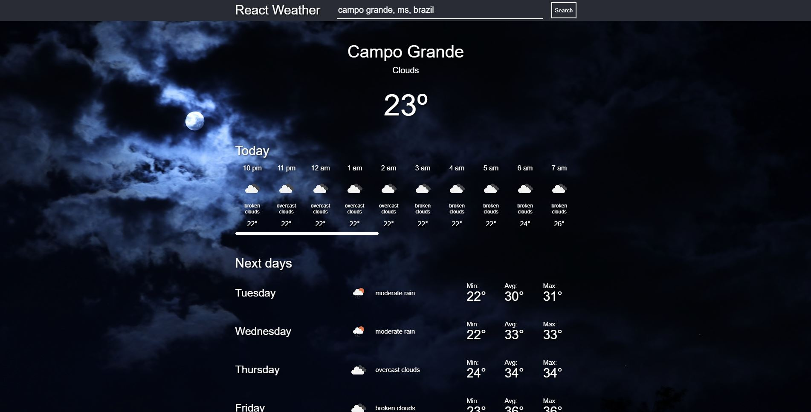
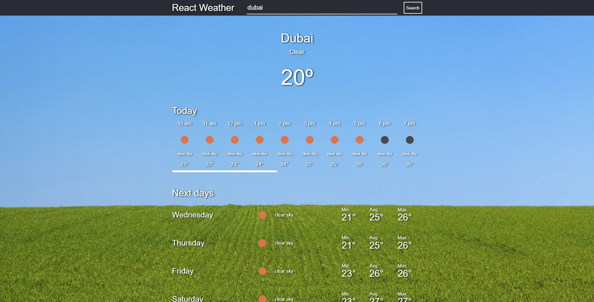

# React Weather

This application was created for educational purposes. It uses React and a free [OpenWeather API](https://openweathermap.org/) to get the weather conditions and forecast of a given city.

However, if the OpenWeather API is unnavailable (or you don't want to create a account just to test if), you can use the offline methods in `weatherApi.js`.

## Screenshots

## Libraries

- React
- Redux
- Jest
- Testing Library
- Axios
- Formik
- Moment

## How to run

1. Clone this repo
2. Run `npm i`
3. Run `npm start` if you are using Linux/Mac or `npm run start-win` for Windows

## Future improvements

- Create a IoC container to decouple components from dependencies (services, Redux, etc)
- Use cross-env
